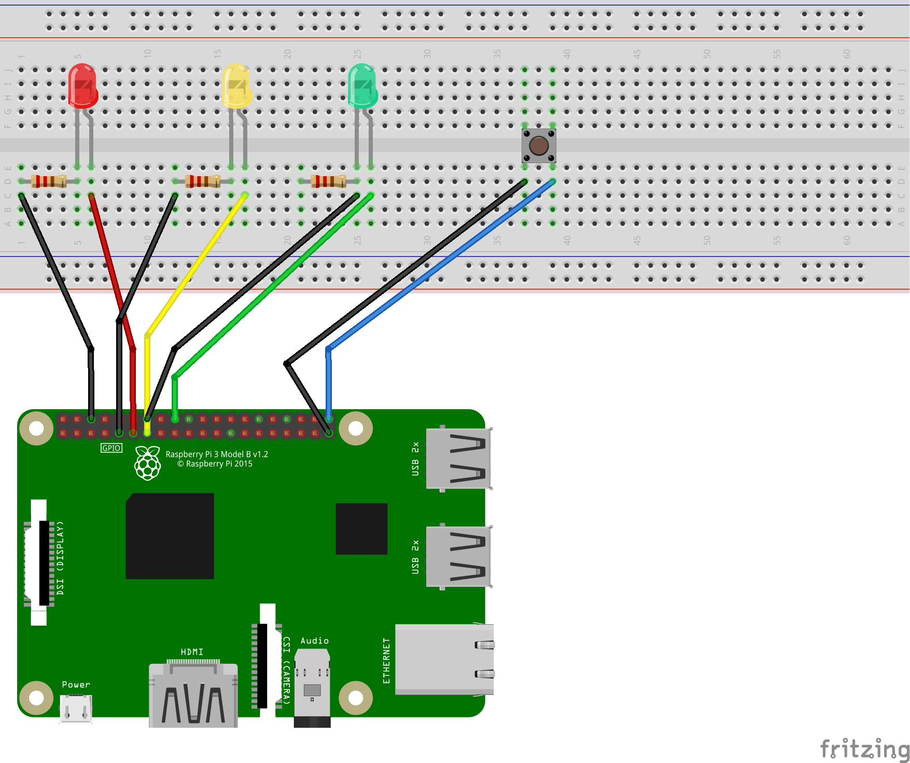

# Semáforo

Construindo um Semáforo com pedido de pedestre

## Material Necessário

* RaspBerry Pi com sistema operacional Raspbian instalado
* Protoboard
* Leds nas cores: Vermelho, Amarelo e Verde
* Jumpers Macho/Fêmea
* Resistor 220ohms

## Configuração do GPIO Raspberry



## Execução

```bash
python semaforo.py
```
